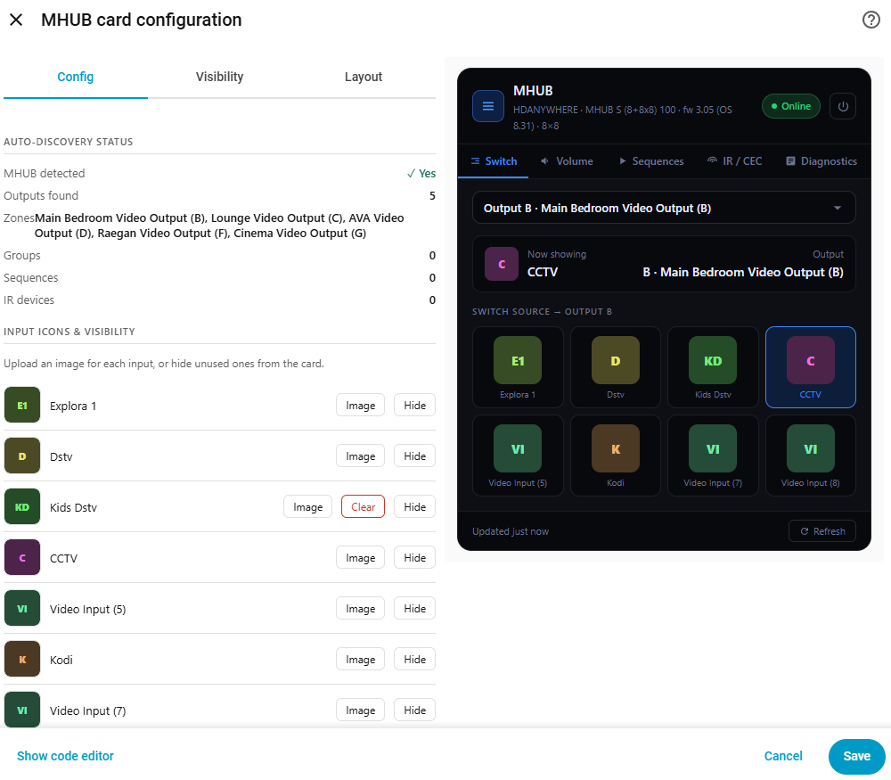
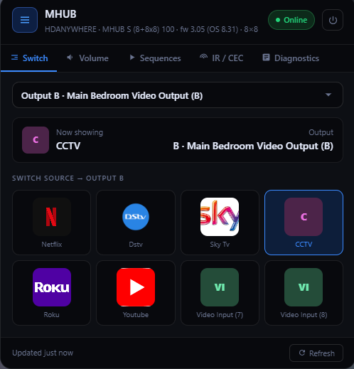

# 🟣 HDAnywhere MHUB — Home Assistant Integration

👨‍💻 **Author:** @marsh4200  

A lightweight, plug-and-play Home Assistant integration for controlling your  
HDAnywhere MHUB matrix system over the local LAN API.

⚡ No cloud. No lag. Just control.

---
THIS INTEGRATION WAS ONLY POSSIBLE THANKS TO **In collaboration with:** [SMARTHOME 21](https://smarthome21.co.za)
---

## ✨ Features

### 🎛️ Button-Based Control (Default)

Control your MHUB using direct press buttons:

• Each output has buttons for available sources (DSTV, Apple TV, Kodi, etc.)  
• Press instantly routes that source to the selected output  
• Fast, simple, and dashboard-friendly  

---

### 📺 Media Player (Optional)

Media player entities are also available:

• Disabled by default  
• Can be enabled if preferred  
• Useful for compatibility with existing automations  

---

### 📊 Live Output Status

• One sensor per output  
• Displays the current routed source  
• Updates in real-time  

**Example:**

Output F → Kodi  
Output A → Apple TV  

---

### 📺 IR & CEC Control

Per output control support:

• IR control (via uControl / IR routing)  
• HDMI-CEC control (TV power, volume, etc.)  

👉 Configurable per zone  

---

### 🔊 Audio Control

• Per-zone volume (0–100)  
• Mute / unmute per output  

---

### 🔌 Power Control

• System ON / OFF control  
• Fast local execution  

---

### 📡 100% Local

• Uses MHUB REST API  
• No cloud dependencies  
• Instant response  

---

### 🧠 Smart Auto-Detection

• Detects MHUB model automatically  
• Maps inputs and outputs dynamically  
• Creates entities based on your system size  

---

## ⚙️ What it does

• Auto-detects MHUB model, inputs, and outputs  
• Creates clean entities for each zone  
• Source routing per output  
• Volume + mute control  
• IR and CEC support per zone  
• Proper device grouping inside Home Assistant  
• 100% local control (no cloud)  

---

## 🧩 Installation

Click the HACS button above to install.

Then go to:

Settings → Devices & Services → Add Integration → HDAnywhere MHUB (Local)

---

## ⚙️ Configuration

| Field | Description |
|------|------------|
| IP Address | MHUB local IP (e.g. 192.168.88.186) |
| Port | Usually 80 |
| Name | Optional |

👉 Click Submit — everything is auto-configured.

---

## 🧠 Notes

• No YAML required  
• Everything is handled via Config Flow (UI setup)  
• Works fully locally on your network  

---

## 🧑‍💻 Development

This integration is actively being developed and improved:

• UI simplification  
• Faster response times  
• Expanded control features (IR / CEC / automation support)  

---
MHUB-Card (Recommended)
Repo: https://github.com/marsh4200/mhub-card.git
---
### Overview

## 💜 Motto

No cloud. No lag. Just control.
