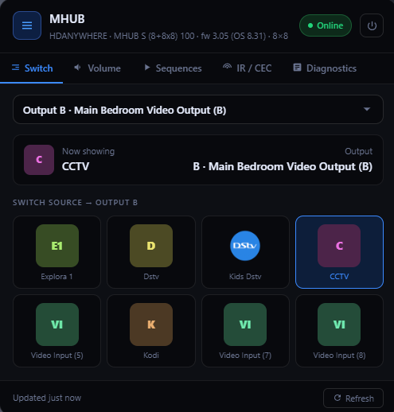

# 🟣 HDAnywhere MHUB — Home Assistant Integration

<p align="center">


[](https://github.com/marsh4200/mhub/releases)
[](https://www.hacs.xyz/)
[](https://github.com/marsh4200/mhub/stargazers)
<br><br>

[](https://my.home-assistant.io/redirect/hacs_repository/?owner=marsh4200&repository=mhub&category=integration)


</p>


[](https://github.com/marsh4200/mhub/releases)


👨‍💻 **Author:** @marsh4200  


A lightweight, plug-and-play Home Assistant integration for controlling your  
HDAnywhere MHUB matrix system over the local LAN API.

⚡ No cloud. No lag. Just control.

---

## ✨ Features

### 🎛️ Button-Based Control (Default)

Control your MHUB using direct press buttons:

• Each output has buttons for available sources (DSTV, Apple TV, Kodi, etc.)  
• Press instantly routes that source to the selected output  
• Fast, simple, and dashboard-friendly  

---

### 📺 Media Player (Optional)

Media player entities are also available:

• Disabled by default  
• Can be enabled if preferred  
• Useful for compatibility with existing automations  

---

### 📊 Live Output Status

• One sensor per output  
• Displays the current routed source  
• Updates in real-time  

**Example:**

Output F → Kodi  
Output A → Apple TV  

---

### 📺 IR & CEC Control

Per output control support:

• IR control (via uControl / IR routing)  
• HDMI-CEC control (TV power, volume, etc.)  

👉 Configurable per zone  

---

### 🔊 Audio Control

• Per-zone volume (0–100)  
• Mute / unmute per output  

---

### 🔌 Power Control

• System ON / OFF control  
• Fast local execution  

---

### 📡 100% Local

• Uses MHUB REST API  
• No cloud dependencies  
• Instant response  

---

### 🧠 Smart Auto-Detection

• Detects MHUB model automatically  
• Maps inputs and outputs dynamically  
• Creates entities based on your system size  

---

## ⚙️ What it does

• Auto-detects MHUB model, inputs, and outputs  
• Creates clean entities for each zone  
• Source routing per output  
• Volume + mute control  
• IR and CEC support per zone  
• Proper device grouping inside Home Assistant  
• 100% local control (no cloud)  

---

## Installation
## HACS DEFAULT
Install the integration directly from the HACS Store. Once installed, the integration will automatically discover any compatible HDAnywhere MHUB devices on your local network using Zeroconf. Simply select the discovered device and complete the setup through Home Assistant's configuration flow.


## 🧩 MANUAL Installation MANUAL

Click the HACS button above to install.

Then go to:

Settings → Devices & Services → Add Integration → HDAnywhere MHUB (Local)

---

## ⚙️ Configuration

| Field | Description |
|------|------------|
| IP Address | MHUB local IP (e.g. 192.168.88.186) |
| Port | Usually 80 |
| Name | Optional |

👉 Click Submit — everything is auto-configured.

---

## 🧠 Notes

• No YAML required  
• Everything is handled via Config Flow (UI setup)  
• Works fully locally on your network  

---


## 🧑‍💻 Development

This integration is actively being developed and improved:

• UI simplification  
• Faster response times  
• Expanded control features (IR / CEC / automation support)  

---

## 🃏 Companion Lovelace Card (Included)

This integration **ships with the MHUB Card** — a fully self-configuring
Lovelace card. It is bundled inside the integration, so there is **nothing
extra to install from HACS**.




### How it loads

When you install this integration and add a hub, the card is **served and
registered automatically** — no `/config/www` copy, no manual *Add Resource*
step (storage-mode dashboards). Then just:

**Edit Dashboard → Add Card → Custom: MHUB Card**

The card reads your MHUB entities straight from the registry and builds
itself — zero YAML required.

### What it does

• 🎛️ One-tap source → output switching  
• 🔊 Per-zone & group volume sliders with mute  
• 🖼️ Custom per-input icons, hide unused inputs  
• ▶️ Run MHUB sequences & functions  
• 🏷️ Friendly output aliases (e.g. *Output B → Main Bedroom*)  
• ⚡ Optimistic UI — switches update instantly  

### 🎨 Card designs (v6.3)

The card ships with **six selectable designs**. Pick one per card in the visual
editor (**Card design** at the top), or in YAML:

```yaml
type: custom:mhub-card
design: strip          # classic · glass · remote · strip · panel · poster
```

| Design | Best for | What it looks like |
|---|---|---|
| **classic** | General use *(default)* | The original tabbed layout — unchanged. |
| **glass** | Lounge / phone | Apple-TV-style ambient view. The card glows in the active source's brand colour; sources sit on a grid of gradient tiles. |
| **remote** | Phone, one-handed | A physical handset. Live LCD window (tap to cycle outputs), a D-pad wired automatically to the zone's CEC/IR navigation commands, volume rocker, mute, and source hotkeys. |
| **strip** | Whole house, lodges | One row per output. Tap a row to expand its inputs and volume in place — a ten-room property fits in one card. |
| **panel** | Wall-mounted tablets | Kiosk mode. Oversized touch targets, no tab bar, optionally locked to a single room so guests can't switch someone else's TV. |
| **poster** | Media rooms | Artwork-first 2:3 tiles using your uploaded input images, with a brand gradient fallback. |

Every feature — custom input images, aliases, hidden inputs/outputs, sequences,
IR/CEC, diagnostics, multi-hub binding — works identically in all six; they are
skins over the same engine. Different cards on different dashboards can each
use a different design.

#### Colours

Set per card in the editor, or in YAML:

```yaml
type: custom:mhub-card
design: poster
accent: "#ff8c42"      # highlight colour — omit to follow your HA theme
card_bg: "#0b0d12"     # card background — omit to follow your HA theme
radius: 20             # corner radius in px, 0–48
```

Both colours default to your Home Assistant theme, so the card keeps matching
your dashboard unless you deliberately override it. Only `#rgb`, `#rrggbb` and
`#rrggbbaa` values are accepted; anything else is ignored.

#### Design-specific options

```yaml
# panel
lock_zone: "B"         # lock the kiosk to one output; hides the room picker
show_tabs: true        # bring back the Volume/Scenes/Remote/Info tab bar

# poster
lock_zone: "B"
poster_columns: 4      # 2–6, default 3
```

### Manual resource (YAML-mode dashboards only)

If your dashboards run in YAML mode, the card file is still served — add the
resource yourself:

```yaml
url: /mhub/mhub-card.js
type: module
```

> ℹ️ The card lives at `custom_components/mhub/frontend/mhub-card.js` and is
> maintained here, in this repository.

---

## 💜 Motto

No cloud. No lag. Just control.
